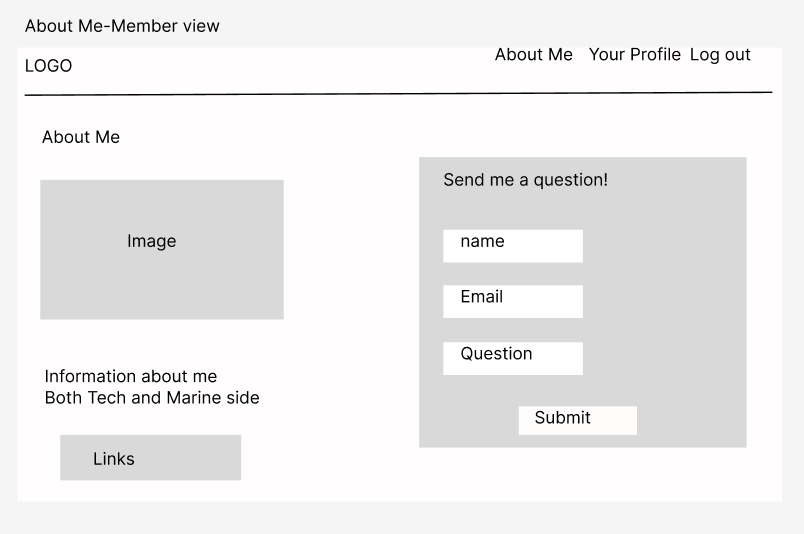

# Project 4 - Buddies of the Ocean

## Description

Project 4 is a full-stack project for my course recently built with Python Flask for the backend serving data from a Postgres database, and a React front-end showing the API. The project includes CRUD functionality and applying skills that were learnt through the whole course.
Buddies of the Ocean is an app for people to learn information about the British Isles’ coastline and the threats it is facing. It also has a community page for people to share local projects.

## Deployment Link

[Buddies of the Ocean](https://main--oceanbuddies.netlify.app/)

## Getting Started

To get this project up and running on your local machine, follow these steps:

For the backend:

1. Clone the repository: git clone git.github.com: hoenigma/project-4-backend.git
2. Install pipenv: pipx install pipenv
3. Run the seed to get the database started: pipenv run python seed.py
4. Run the backend: pipenv run flask run

For the frontend:

1. Clone the repository: git clone git.github.com: hoenigma/project-4-frontend.git
2. Install the packages: npm i
3. Run the frontend: npm run dev

## Timeframe

For Project 4, I worked on it on my own and was given about a week and a half to complete it.

## Technologies Used

### Backend

- Python
- Flask
- SQLAlchemy
- Bcrypt
- Json Web Token
- Marshmallow
- PostgreSQL (for database)

### Frontend

- React
- Bulma
- Vite
- Axios
- Font Awesome
- TypeScript

### Other

- Git

## Brief

For this project I was given a list of requirements I had to meet. These included:

- Build a full-stack application by making your own backend and your own front-end
- Use a Python Flask API using a Flask REST Framework to serve your data from a \* Postgres database
- Consume your API with a separate front-end built with React
- Be a complete product which most likely means multiple relationships and CRUD functionality for at least a couple of models
- Implement thoughtful user stories/wireframes that are significant enough to help you know which features are core MVP and which you can cut
- A working app hosted on the internet
- A link to your hosted working app in the URL section of your Github repo
- A git repository hosted on Github, with a link to your hosted project, and frequent commits dating back to the very beginning of the project

## Planning

At the start of the project, wireframing was made on Figma, database plans were made on quick database diagrams and notes made on Bear.

### Wireframing:

**Home Page and Navbar**

The home page will welcome the user (either a generic welcome or use their name if they have signed up), a description of the app and some cards that will have links to other pages. For the member view, the sign up card is replaced with the “your profile” card.
The navbar for visitors will have a logo that when clicked will take the user to the home page. Other tabs are there for “about me”, “sign up” and “login” taking the user to those pages.
The navbar for a member doesn’t have a sign up or login and is replaced with a Profile page and a logout button. The navbar is the same on every page.

**Select a Region**

For the select region page the member and non member view are the same.
This page will have the regions as cards including their name, an image and some of the areas they include. Each card will link to the show region page for that region.
The search bar will search the country region and any area a region may have.
The drop down menu will contain the regions you can choose from.

**Show Region**

Once clicked on a card the user will be taken to the show region page showing the info above. Wildlife, threats and links will be shown as lists.
For members they will have a link to local projects for that region. A stretch goal is to add a favourite button that the user can have.

**Projects Page and Add Projects**

The projects page will show projects people add. If you created a project you will be able to update it/delete it. Comments will be added as stretch goals.
The add project page will include filling details including the date, time of the project, a link to the project (optional), some information, the area the project will take place (this is manually typed so the user can be specific).

**About Me**

The about me section will have some information about me and links to my linkedin, github and portfolio.
For members there will be a send me a question form. This is a stretch goal that will be linked to an email which I will receive by using emailJS.

**Sign Up and Login**

The Sign Up and Login pages will both be forms and both handle error messages.
Once signed up it will take the user to the login page.

**User Page**

The user page is a stretch goal. The plan for this page is somewhere for the user to update any details of theirs and delete their user if they want to.
It will also include any projects they posted and their favourite region.

**Datebases**

Above shows my plan for the databases. There are 3 main ones with 4 sub ones to hold extra data.

User will include a userID which will be given when a user is created, username, email, name will be added when the user added themself. The password_hash will be created from the password the user puts in. Roles are given to the user, there are 2 roles so far shown by the number 1 or 2. Users signing up will be given 2 (normal user roles), the 1 is for admin users which at the moment will be my user.

Region will have a lot of sub tables attached to it. The idea of this is the areas, wildlife, threats and links will all be in arrays so it was advised to separate them into separate tables for each region to get from.

Projects have date, time, area, description and link which the user will type in. It will grab the userID from the user and the regionID from the region.

## Build Process

### Day 1

To begin the focus was on laying the foundation for the project. This involved wireframing to visualise the interface, planning the models to structure the data, and creating a to-do list to keep track of tasks. Setting up the backend and frontend environments was essential, including installing necessary packages and ensuring both sides were functioning correctly through testing.

### Day 2

On the second day, attention shifted towards implementing the models and serializers for the backend. Data seeding was crucial for populating the database, while user authentication features like signup and login were developed, although encountering challenges with the favourite region feature. Additionally, a secure route file was created and given to routes that needed it (projects route).

### Day 3

On the third day, the backend was further expanded with additional endpoints for the regions, users, and project controllers. Each endpoint was thoroughly tested to ensure proper functionality and reliability.

### Day 4

On the fourth day, he focus shifted towards enhancing user experience and interface design. This included adding password confirmation in the user serializer, setting up routes, creating a navbar, and developing various frontend components like the home, signup, login, about me, and user interface pages. Additionally, images for region seeds were sourced to enrich the visual experience.

### Day 5, 6 and 7

The next three days were dedicated to the frontend specifically on the components and improving styling. Features like displaying regions and projects, adding, deleting, and updating projects (see image below), and refining the user interface were worked on extensively. Interfaces were created and integrated, while attention to detail was paid to styling elements such as the navbar, background images, cards, buttons, and overall layout responsiveness.

### Day 8

The eight day was deployment day. Preparations were made alongside further refinements to the user interface and experience. Mobile-friendliness was prioritised, and components were optimised for various screen sizes. Additionally, work began on the footer component, and styling adjustments were made throughout the application.

### Day 9

The last day was about finalising the project with additional styling, ensuring consistency across components, and addressing any remaining issues. Features like a form for contacting the developer were added, and extensive styling adjustments were made to various components for a polished final product.

## Challenges

During the start of the project, I had trouble understanding 1 to many relationships and how to implement them. This was achieved by going through my class notes and discussing this with other colleagues to understand what this relationship is. Doing this early in my project made it easier to understand how my models would interact with each other and how to work them in the front end.

Whilst creating the search function in the regions’ page, I had trouble filtering by area. Unlike the region name where I could use the .includes(value) where value is the region name I gave in the model, the area is in an array and not all will be showing in the regions’ page. To solve this I had to first work out how to get the names of the areas by doing: region.areas[0].names. This is because the areas are in an object in an array so I have to use [0] to get into areas and then .names as it has names and images in the array. I gave this the constant areaNames. To filter this I used the .some function so it would find any area name that matches the value that is typed. The end result looked like this:

Another challenge I faced was with connecting the frontend and backend with the fetch functions. When a page was refreshed/navigated to, the URL would have extra path names added to it meaning it wouldn’t be linked to anything. To fix this I firstly changed the backend paths to unique names matching the front end to not cause conflicts. Then in the fetch I made the path in the local URL match my server (localhost:5173). This meant when I was developing the app, it would always match the path I have given it. When deploying the project using the {baseURL} also fixed this problem.

## Wins

One of my stretch goals was to add a form that would send an email to me. To do this, I found EmailJS which is a service that allows email to be sent from the code. The website gives code for how to get this to work. Using that I created this in the handle submit function of my form:

I had to import emailJS in the terminal to get the .sendForm function. This function needed 4 inputs. The first is the service ID, this is linked to the email provider I have linked it to (in this case the gmail account I created for this project). The second is the template ID, for the account I created a template email which is linked to the values in my code (name, email and question).

The third is e.target which is getting the information from the input elements to send in the email. The fourth is the UserID which works like a token to check if there is a valid user for the service. After that, the form needs to be reset so I used a .then to set the form data to blank once the user has submitted a question.

One component I was proud of was my RegionCards component. I had to get certaijn information I wanted to show, including getting the areas from the data. This was achieved by checking the areas array exists and has at least one element. If “areas” is an array and has elements, the names of the first area are extracted into the areaNames variable. This assumes that each area object in the areas array has a names property. To display it I needed to use areas[0].names[X] where x is a value in the array.

This code efficiently renders region cards, dynamically displaying information about each region, such as its name, image, and areas.

## Key Learnings

During this project, I primarily utilized Express.js for the backend and Axios for making HTTP requests from the frontend. Initially, I encountered challenges in establishing the connection between the frontend and backend. However, I successfully resolved these issues by ensuring that I used the full URL of the localhost in my Axios requests, which allowed seamless communication between the two layers of the application.

Throughout this project, I encountered challenges that required self-motivation and perseverance to overcome. Working independently, I learned the importance of setting achievable goals, breaking down tasks into smaller milestones, and celebrating progress along the way. I discovered the value of maintaining a positive mindset and seeking support from online communities, forums, and documentation when facing obstacles. Additionally, I practiced effective time management techniques, such as prioritizing tasks, setting deadlines, and taking regular breaks to prevent burnout. These experiences have strengthened my ability to work autonomously and stay motivated in pursuing my engineering goals.

## Future Improvements

There are some extra stretch goals I would like to add to this project:

- Comments to the projects
- Favourite region
- Change password on user profile
- Modal for the delete button (to confirm user wants to do it)
